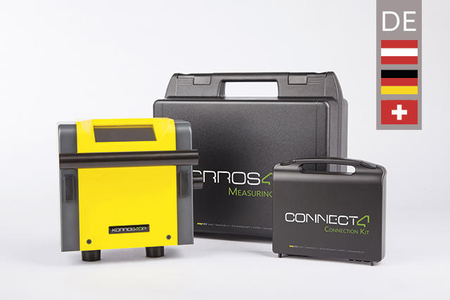
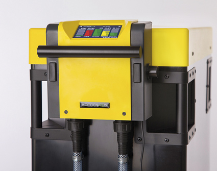

# **Korrostop4.0** - _deutschsprachige Informationen_

## Was ist **Korrostop4.0**

_**Korrostop4.0**_ ist ein zuverlässiges, präzises Messgerät zur Messung des Leitwerts, Temperatur und Durchfluss von deionisiertem Wasser. [_**Korrostop4.0**_](https://www.easymetal.com/produkte/korrostop-40/korrostop-40.html) ist ausschließlich zum Einsatz mit der [_**E.KO IONISER**_](https://www.easymetal.com/produkte/eko-ioniser/anwendungsbereiche.html) Serie von [_**easymetal**_](https://www.easymetal.com/) zugelassen. Wenn Sie _**Korrostop4.0**_ unabhängig davon einsetzen wollen, kontaktieren sie uns bitte [hier](https://www.easymetal.com/unternehmen/kontakt.html).

Ursprünglich für den industriellen Einsatz für die [Wasseraufbereitung bei funkenerosivem Schneiden](https://www.easymetal.com/branchenloesungen/edm/prozesswasser-erodiermaschine-optimale-wasserqualitaet.html) konzipiert, werden die _**E.KO IONISER**_ mit _**Korrostop4.0**_ aufgrund der hohen Qualität immer häufiger in anderen Bereichen eingesetzt.

Die Kombination von _**E.KO IONISER**_ mit _**Korrostop4.0**_ ist an alle Maschinen aller Hersteller anpassbar und bietet mit seinen vielen Kommunikationskanälen volle Integrierbarkeit in Ihre bestehende Firmen IT. _**Korrostop4.0**_ ist das ideale Messgerät um die Prozessautomatisierung in Ihrem Unternehmen zu perfektionieren. Siehe auch [**Features**](Alle-Features).

> Die aktuelle Version **SYS412002** ist am 28.01.2020 erschienen. Siehe auch [Versionen](../../wiki/Versionen).

## Hier finden Sie:
* laufend aktualisierte [Informationen](../../wiki) zu **Korrostop4.0**
* [Updates](Updates) für den SD-Karten Update Mechanismus
* [Spezifikationen](../../wiki) zu **Korrostop4.0**
* [Tools und Source Code](IntegrationSamples) zur Automatisation mit **Korrostop4.0**
* Für andere Sprachen siehe auch die [entsprechenden Repositories](https://github.com/easymetal?tab=repositories)

## Zielgruppe dieser Seiten:
* **Interessenten**: Information zu Features
* **Kunden**: Nachschlagen im Handbuch, Updates, ...
* **[Händler](https://www.easymetal.com/wasseraufbereitung-haendlersuche.html)**: Anwendungsfälle und Nachschlagewerk für_ kundenspezifische_ Anfragen
* **Partner**: Anwendungsfälle & Spezifikationen
* **Entwickler** im Bereich der Prozessautomatisierung und Integration: Musterbeispiele & Spezifikationen

> Bild: **Korrostop4.0** auf **E.KO IONISER 1501** 

_© 2020 by [easymetal](https://www.easymetal.com/)_

## QR Code Links:
* zu dieser Seite _(https://github.com/easymetal/Korrostop4.0-DE)_: **[Images/qrDE.png](Images/qrDE.png)**
* zu den Wiki Seiten _(https://github.com/easymetal/Korrostop4.0-DE/wiki)_: **[Images/qrWiki.png](Images/qrWiki.png)**
* zu den GitHub Seiten von easymetal _(https://github.com/easymetal)_: **[Images/qrEasymetal.png](Images/qrEasymetal.png)**
* zur esymetal Webseite _(https://www.easymetal.com/)_: **[Images/qrWEB.png](Images/qrWEB.png)**
